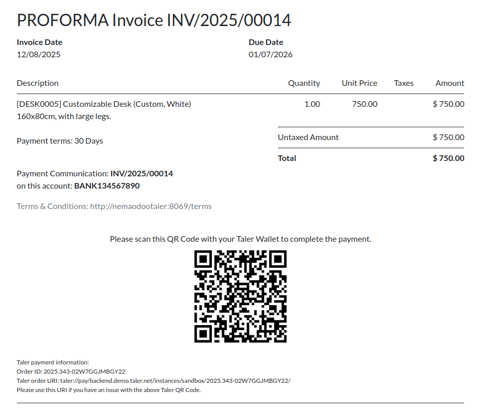

<!--
SPDX-FileCopyrightText: 2025 Mael Panouillot <panouillot.mael@gmail.com>

SPDX-License-Identifier: CC0-1.0
-->

On the 9th of December 2025:

Small update today, I redid the QR Code integration in invoices, to make it more robust and look nicer

This looks way more professional!

I am having an unrelated, complex issue. I keep getting already-claimed orderIDs when posting an order on Taler after resetting the testing DB, and I know why it happens, it is due to the fulfillment message or fulfillment URL repeating from a previous DB running.

but it shouldn't happen because I setup multiple systems to go around that, and it shouldn't happen to a regular user, but it still happens to me in my testing environment. I am thinking of adding some random text to the end of the OrderID to avoid the issue, but it'd be messy and could lead to more unpredictable issues. So I will need to take some time to think about a fix for this one.

Other than that, next step is implementing payment for event tickets.

Quick update:
I spent 2 more hours on this claimed orderID issue, and I implemented a uuid system for the fulfillment message and URL, and it seemed to resolve the issue I was encountering.

This UUID is only used for the fulfillment url. Without the UUID in the url, the Taler merchant could mix up two orders with the same Odoo ID, on two different Odoo instances

This is not a perfect solution, as two duplicate UUID for the same OrderID could be generated on two different Odoo instances, on the same Taler Merchant, but this is highly unlikely.
