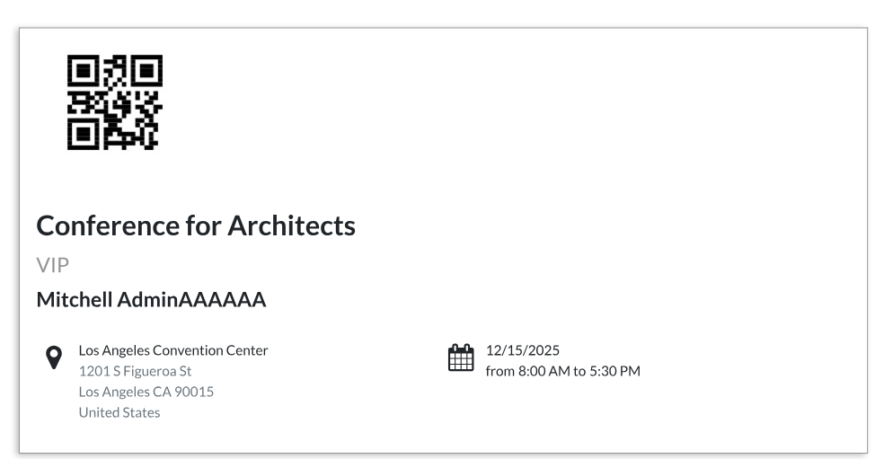

<!--
SPDX-FileCopyrightText: 2025 Mael Panouillot <panouillot.mael@gmail.com>

SPDX-License-Identifier: CC0-1.0
-->

On the 10th of December 2025:

Today I implemented the flow for event tickets and registration, as well as the flow for bookings with up-front payment. Luckily, both of these flows only required minor tweaks compared to previous payment implementations!

Note: to have the proper ticket ordering system, you might need to install the Odoo events module, as well as the python module pycairo:
    - 1. sudo apt install libcairo2-dev
    - 2. pip install rlPyCairo

Next step: Implementation of Self-ordering at Point of Sale! This flow will require a much tighter management of the Taler QR Codes, and will need a new implementation I think. As it is one of the last main flows required, Iafter it, I will be able to tackle code bolstering, and taking care of non-flow sub-milestones.
