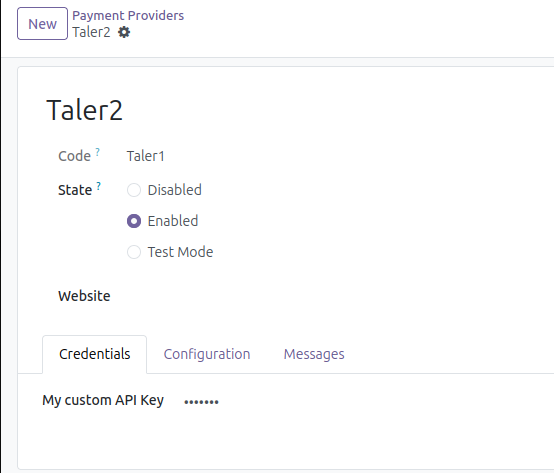
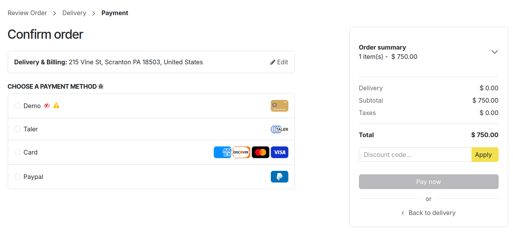
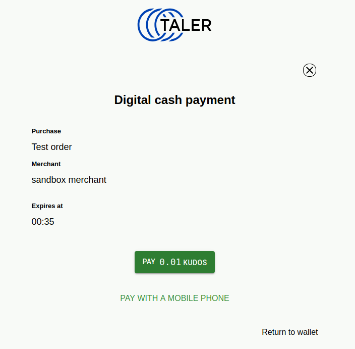
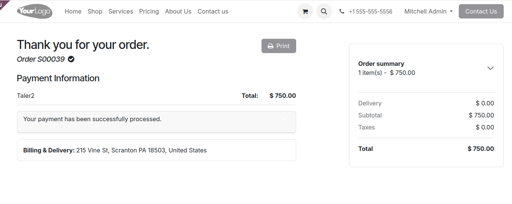
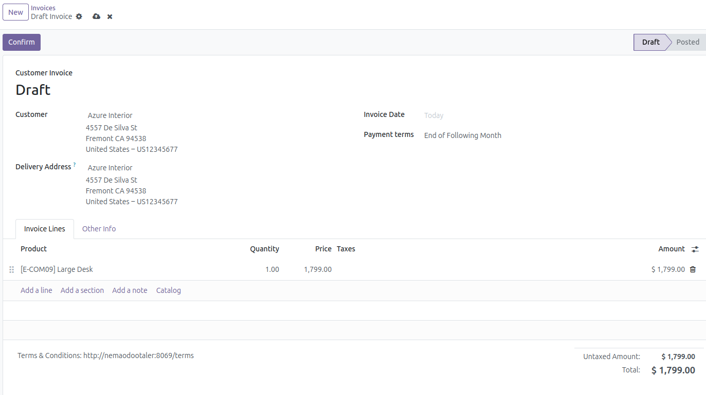
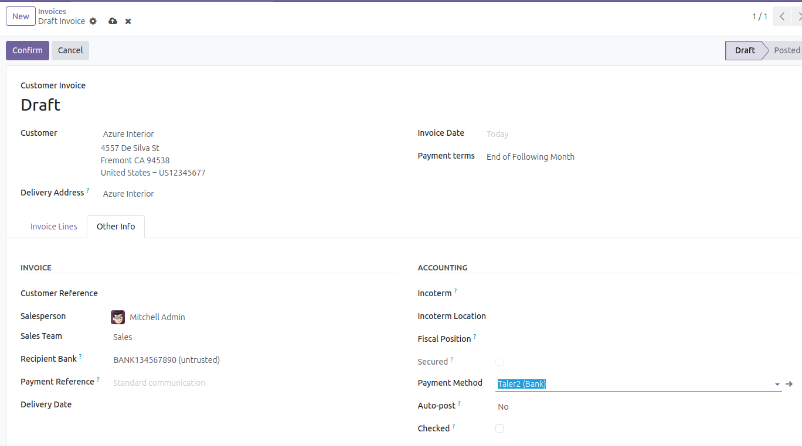
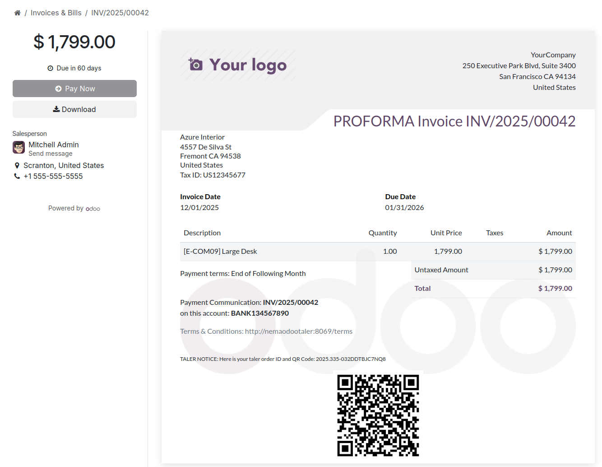

<!--
SPDX-FileCopyrightText: 2025 Mael Panouillot <panouillot.mael@gmail.com>
-->

On the 30th of November 2025:

Hi all! I haven't made a devlog in a long time, but I didn't stop working on the addon, and I have multiple great news :)

I made multiple commits and great progress since the last devlog, and I integrated the Taler flow for Odoo Website eCommerce, as well as Accounting/Invoice. These two steps are required for Milestone 2 and 3.

### Website:
For the Taler integration in website eCommerce, users can install Taler on their Odoo install. This adds a new Payment Provider. (please ignore inaccurate numbers and "Taler2" name, it's for testing purposes)

From there, clients of this user will be able to choose to pay with Taler

If selected, the client will be redirected to a taler payment page, and can use a qr code, or their pre-installed wallet-addon to pay.

Once they pay, they are redirected to the odoo website, where they can see that the order is completed

Note: This flow requires more work to make it more robust and reliable.

### Accounting/Invoices:

Odoo users can now create invoices that include Taler information.

When creating a new invoice within Odoo

Users can go to "Other Info", and assign Taler as their payment method

If taler is selected, the created invoice will include the Taler payment URI, as well as a QR code for easy access to the person who will pay the invoice.

The invoice needs some beautifying, as well as a better follow-up once an invoice has been paid, but that'll be for later.

Note: I did not implement yet an automatic system to know if a Taler invoice has been paid. I'll look into it, but I am not yet sure if it is possible.

### Immediate next steps:

The code repository needs some cleaning. I have been stacking prototypes on top of non-working proof of concepts, and I need to dedicate some time to clean the workspace and remove unused or non-working pieces. I will also complete the accounting flow, as well as complete some items that are sitting in the TODO list.

A scary step to me is to figure out how fees work with Taler, to make sure I can display them properly in Odoo before the client completes the checkout. But I have to tackle it soon.

### Closing

I am thinking of progressing the milestone 2 and 3 simultaneously, because completing the Taler flows is the most important part of this addon, and the "secondary parts" of milestone 2 and 3 will be possible to complete when the flows are completed.

I intend to make good progress this December, I should be able to complete the milestone 2, and maybe even the milestone 3!!

See you all on the next post :)
