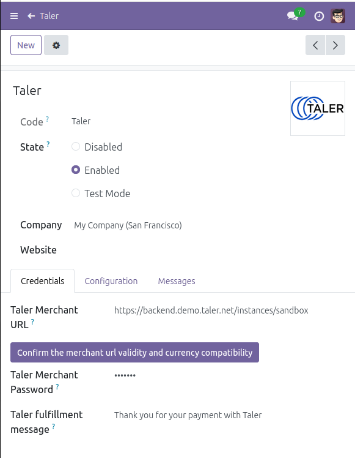
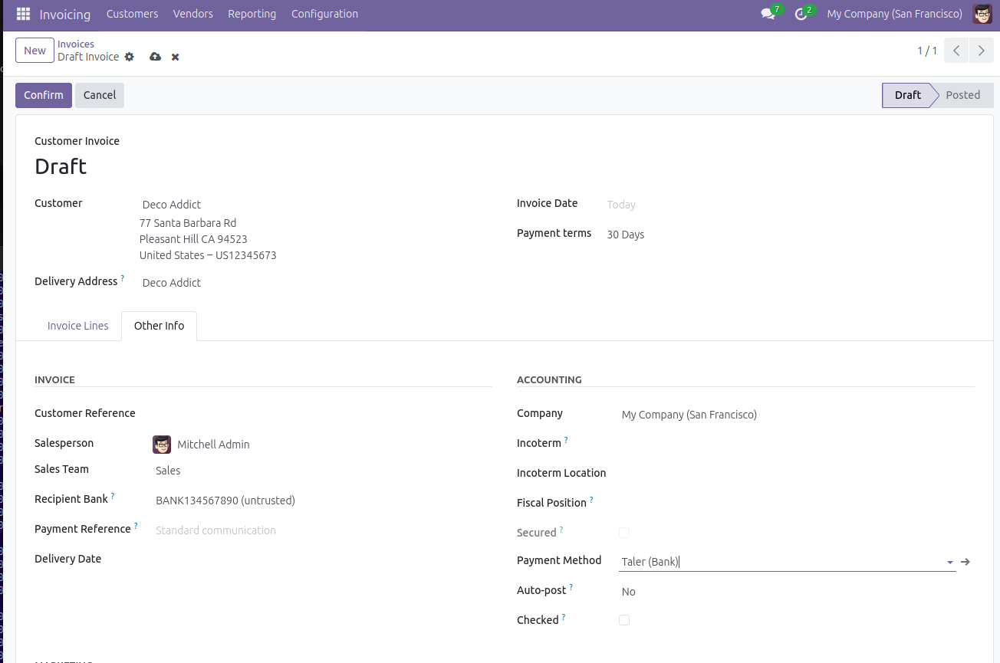
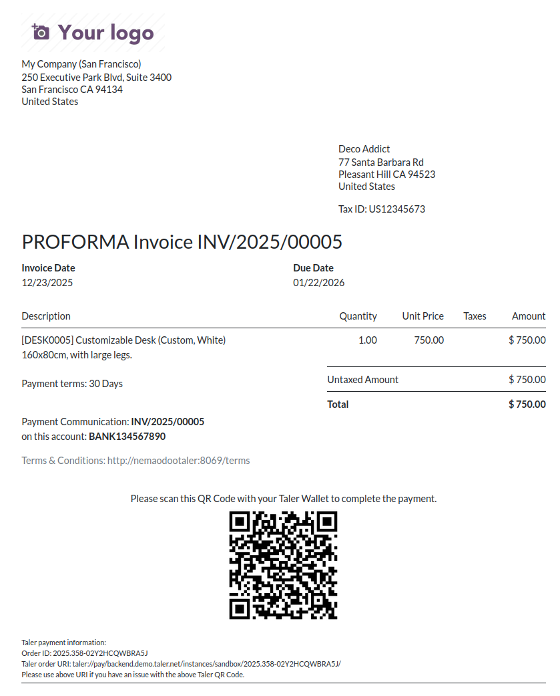
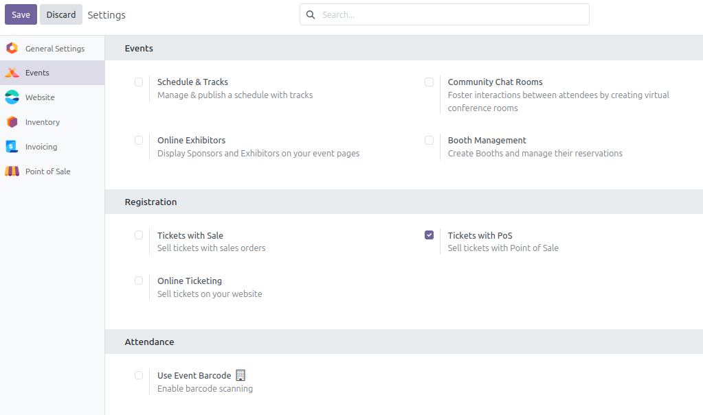
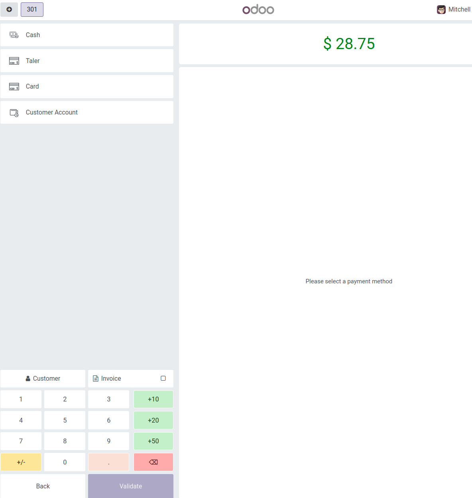
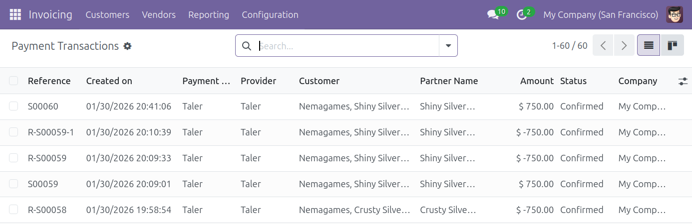
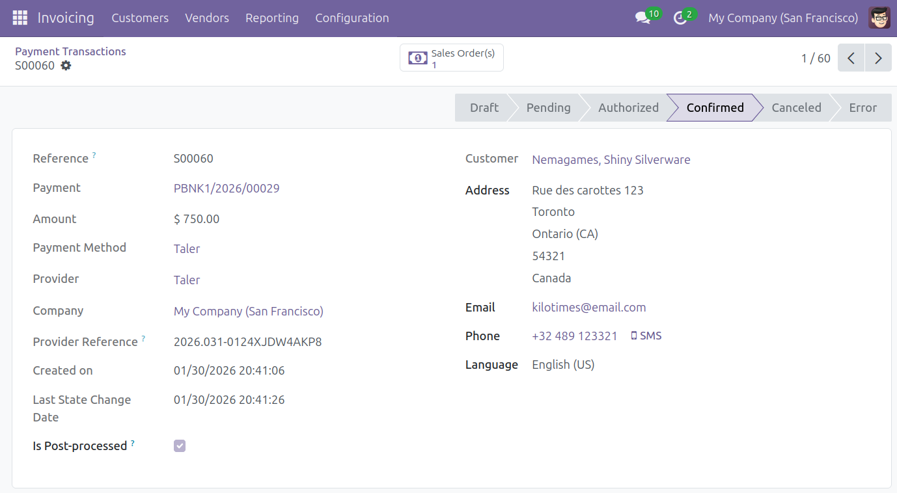
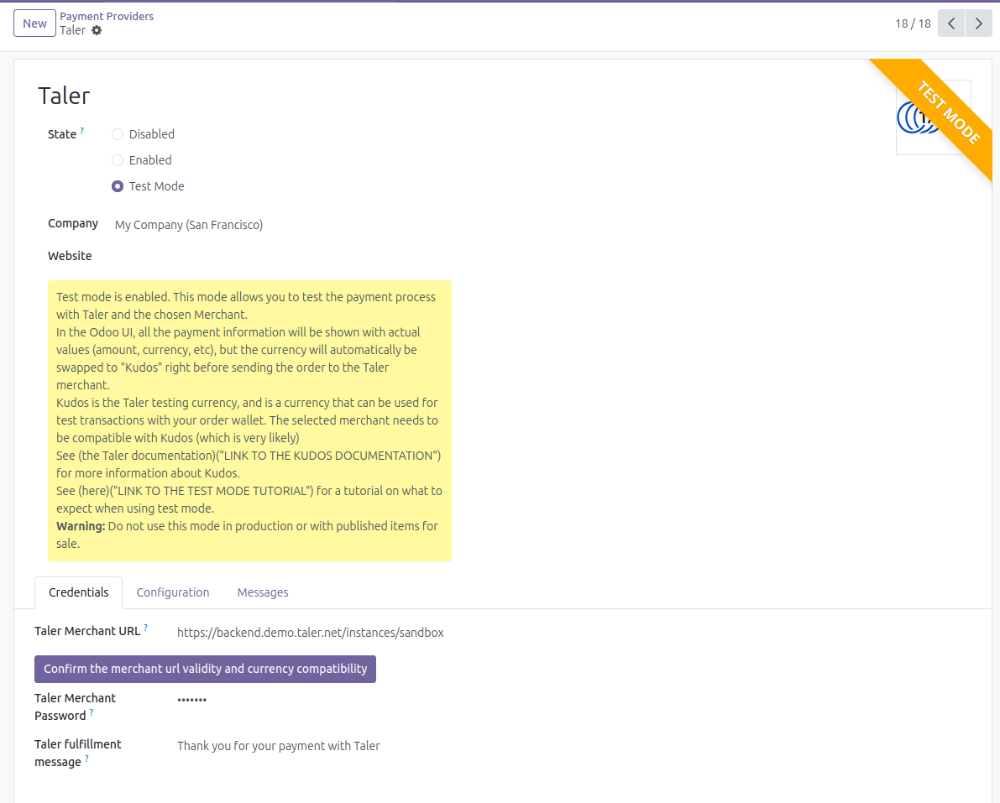
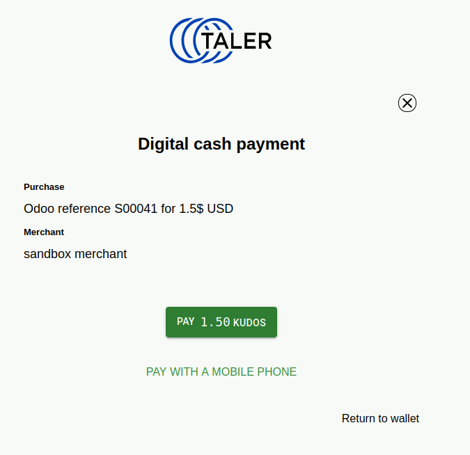

<!--
SPDX-FileCopyrightText: 2025 Mael Panouillot <panouillot.mael@gmail.com>

SPDX-License-Identifier: LGPL-3.0-or-later
-->

# TOPS: Taler-Odoo Payment System

TOPS is a currently in-development add-on for Odoo.

This Odoo add-on allows users to pay with Taler, similar to other existing payment integrations in Odoo.
It is developed using the Odoo Framework, in Javascript and Python. The module integrates into and increase functionality of other existing Odoo modules (ticket sale, online shopping, invoices, etc.).

Installing this module allows merchants to offer their customers to use their Taler wallet to pay, allowing users to choose a payment system that respects their privacy.

Once finished, it will be made available on the Odoo Apps store https://apps.odoo.com/apps

---

## Tutorials, flow examples and walkthrough

### Install the add-on on an already-existing Odoo installation

- Clone this repository
  - Preferably in {your Odoo install}/custom_addons
    - Make sure that the "tops" directory in "custom_addons"
  - Note: the code can be extracted anywhere, but it's easier to have it in the Odoo folder
- In the command line you use to start Odoo, add the argument `--addons-path=./addons,./custom_addons`
  - Such as: `./odoo-bin --addons-path=./addons,./custom_addons -u tops -d odoo18_tops_0.1.1.1`
- In Odoo, go to the `Apps` section in the app switcher (top-left button)
- Click `Update Apps List` on the top bar
- Search for the add-on `Taler-Odoo Payment System`
- Click on the add-on, and press "Install" to complete this step 

> To update the add-on, you can pull from the repository you cloned earlier, and press "Upgrade" on the add-on page

### How to setup the Taler payment provider

- Once the addon is installed from the Apps:
  - Go to the payment providers menu. It can be accessed in multiple ways:
    - Website -> Configuration -> eCommerce -> Payment Providers
    - Invoicing -> Configuration -> Online Payments -> Payment Providers
  - Either way you land here, this is the list of your currently available payment providers.
  - You will see a new payment provider in this list, "Taler", which is set as disabled for now
  - Click on the Taler payment provider
  - Click the "Enabled" radio button
  - In the "Credentials" tab, set the Taler Merchant URL you plan to use
    - After setting the URL, you can click the "Confirm the url validity" button to check if the entered URL is reaching a valid Taler Merchant, and that this merchant's accepted currencies are compatible with you TOPS available currencies
  - Then set your Taler Merchant Password, which will be used for API calls to the merchant
  - You can change the Taler fulfillment message, which will be shown on created Taler transactions, only on Taler side, not on Odoo side.
    - If you'd like to change the Odoo messages shown to the user after a payment using Taler, you can do so in the "Messages" tab on the same page
  - The default values are for the sandbox merchant server
    - URL: https://backend.demo.taler.net/instances/sandbox
    - Password: sandbox
  - It is advised, but completely optional, to create a Taler-specific Journal (available in the Configuration tab)
    - This will help during the Accounting process
    - This step could be helpful for you, depending on your accounting setup
- The initial setup is now complete and Taler payment will be available in all eCommerce and Invoicing apps.

### Completes an eCommerce payment

- Once you have completed the Taler initial setup, customers can pay on your website
- To do so, they will open the shop and add any items in their cart
- During the checkout, they can now choose the "Taler" payment provider

- After clicking "Pay now", a new Taler order will be created on the merchant side, and the customer will be redirected to the Taler order, from which they can pay with any Taler wallet on their phone or web browser

- Upon completion of the payment using their wallet, the customer will be redirected back to the Odoo instance, where it will show a confirmation that the payment was successfully processed

### Creating an invoice that can be paid with Taler

- It is possible to create an invoice that can be paid specifically with Taler
  - Go to the Invoicing app and create a new invoice
  - Fill any data relevant to the invoice that you are creating
  - Important step: In the "Other Info" tab, set the Payment Method to "Taler":
  

- When you are done, click "Confirm" at the top, you will be led to the invoice page
  - You can now click "Preview" to see the Invoice that will be sent to your customer
  - The Invoice PDF that is created will include a Taler payment QR Code, as well as Taler order information on the bottom:

- What should I do when a customer pays for an invoice using the Taler QR Code on the invoice?
  - If a customer pays for the invoice using the QR Code on the invoice, you will have to do a manual payment reconciliation
  - To do this, go to the Invoices' app page (where you clicked on "Preview" earlier)
  - Click on "Pay"
  - Confirm the data shown in the opened window, it is recommended to add the Taler OrderID shown on the invoice, to the "Memo" field, to keep track of the payment more easily
  - Press "Create Payment"

### Online invoice payment using Taler

> This process is unrelated to the invoices created with Taler in the previous step
> 
> Any created invoices can be paid online using Taler

- Go to the Invoicing app and create a new invoice
- Once created, you can press "Preview" to see the page that the customer will see
- On this page, the user will be able to click "Pay Now", and choose Taler as a payment provider

- Once they click this button, they will be redirected to the Taler order page, where they can pay with a Taler wallet on their phone or web browser
- When the payment is complete, the customer will be sent back to the invoice page, with a green notice saying that the payment is complete

### Online Event tickets purchases using Taler

> Note: to have a fully working ticketing system, you might need to install the python module pycairo:
>    - 1. sudo apt install libcairo2-dev
>    - 2. pip install rlPyCairo

- How to make event tickets available for customers to pay for using Taler
  - Add the "Events" add-on on your Odoo instance
  - Go to the settings app, and navigate to the "Events" settings
  - Tick the "Online Ticketing" and save the changes

  - Tickets are now available to buy using Online payments providers, including the Taler payment provider!
  - Customers can now navigate the "Events" tab on your website, and choose any event they'd like to purchase a ticket to

  - When they click an event, they can register in it, which will prompt them to give some information, and then lead them to a payment page
  - On this payment page, the customer can select Taler as a payment provider
  - They will be redirected to a Taler order page, where they can pay with their wallet or web browser
  - Once payment is finished, the customer will land back on the odoo page, with their payment succesfully processed, and a .pdf of the event tickets available

### How to setup POS payment provider

- Allowing Taler payment on the point-of-sale app requires a few more steps than online payments abovees
- Preliminary steps
  - Only do this step if you have previously [setup Taler as a payment provider](#how-to-setup-the-Taler-payment-provider)
  - Install the "Point of sale" Odoo addon
- Create the Point of Sale payment method
  - On the top bar, press Configuration -> Payment Methods
  - Create a new Payment Method
  - Call it "Taler" (You can call it anything but Taler is easier to remember)
  - Check "Online Payment"
  - Select "Taler" in the "Allowed Providers" field.
- Adding Taler to the point of sale (Make sure that the point of sale register is closed for this step)
  - On the top bar, press Configuration -> Point of Sale list
  - Select the point of sale you'd like to add Taler payment to (for test data, Clothes Shop is a good candidate)
  - Click on "More settings: Configurations > Settings", which will lead you to the point of sale's settings page
    - Alternatively, you can access this page by going to Settings through the app switcher on the top right, then going to "Point of Sale" section, and selecting the point of sale that you would like to modify
  - In Payment -> Payment Methods, add the payment method you just created. It can be named "Taler", or any other custom name you chose
- The setup is now complete, and you can select your new payment provider when a customer pay for an order on the Point of sale that you added the payment method to.

### Payment on a Point of Sale

- Open a register on one of the Points of Sale for which you activated the Taler payment method in the previous step
- Put any items in the order, and once done, click "Payment" at the bottom of the page
- The "Taler" payment method, that you added earlier, should now be available in the payment options

- Clicking on the option and validating it will prompt the customer with a QR Code
- Scanning this QR Code will redirect to an Odoo page, where they will be able to choose to pay with Taler
- This will bring the customer to a Taler order page, and they will be able to pay using their Taler wallet or web browser
- Upon the payment completion, the customer will be redirected to Odoo, with a confirmation of payment (first picture), and the order on the point of sale's side will show a successful payment, and produce the receipt (second picture)

### Refunding an online payment

- To make a refund, you first have to find the payment you wish to refund.
- In the `website` or `invoicing` add-on, navigate to `Configuration -> Payment Transactions` on the top bar.
  - This page will show you all the transactions that have been completed.
- Click the transaction that you would like to refund.
  - In the picture, the transaction to refund is `S00060`.

- On the transaction page, click on the linked payment.
  - In the picture, the linked payment is `PBNK1/2026/00029`.

- On the payment page, click `Refund` in the action button section and confirm the refund.

- Confirming the refund will create a new transaction, that you can view in the list of transactions, with the name `R-{Odoo reference number}`
  - An email containing a QR Code for the customer will also be sent to the customer's email address
    - You can find the list of emails in `Settings -> Technical -> Emails`
  - To receive the refund, the customer will have to scan the QR Code with their Taler wallet.

_Note: You can only do full refunds using Taler. Partial refunds are not implemented, but Taler does allow for partial refunds, so it could be a supplementary feature._

### Merchant test mode

- The merchant test mode allows you to test the installation of the Taler-Odoo Payment System, and confirm that the module and the selected merchant are working properly.
- In the Odoo UI, all the payment information will be shown with actual values (amount, currency, etc), but the currency will automatically be swapped to "Kudos" right before sending the order to the Taler merchant.
- <strong>Warning:</strong> Do not use this mode in production or with published items for sale.
- Here is an example of the flow for this feature:
- On the payment provider's page, check the "Test Mode" radio button

- Then start the process for any online payment, I will show the process for an eCommerce payment
- Navigate to the shop page
- Select any product that you'd like to buy as a test, go to your cart and start the checkout process
- Once you confirm your order, the Taler payment method will appear, with two icons

- Symbols:
  - The red striked-through eye means "Unpublished". It is there to let you know that this payment method is not visible to visitors, only users that have access rights to the shop, will be able to see the test mode Taler payment provider.
  - The yellow warning sign means "Test mode". It is there to warn you that the test mode is activated for this payment method.
- Go ahead and pay the order. A corresponding order will be created on the Taler merchant, with a currency change.
  - The currency is getting swapped with "Kudos"
    - Kudos is an imaginary currency created for Taler. It can be used for free to test transactions with your order wallet.
- A Taler order will be created, with the currency replaced by Kudos, that you can open and pay with your wallet

- Once the order is paid using the imaginary currency, you will be sent back to the completed Odoo order.

- If you reach this step in a similar manner with no raised issues, the test is complete, the add-on works and the Taler merchant endpoint can receive your orders for compatible currencies.

---

### Change settings using CLI

- Run the Odoo CLI shell by adding `shell` to your original command line to start Odoo
  - Such as `./odoo-bin shell --addons-path=./addons,/media/sf_VMSharedFolders/custom_addons -u tops -d odoo18_tops_0.1.1.1`
- Run these commands to edit the setting you want to set. You can use `get_params` to print the current value, and `set_params` to set a new value.
  - `env['ir.config_parameter'].set_param('tops.merchant_url', 'https://backend.demo.taler.net/instances/sandbox/')`
  - `env['ir.config_parameter'].set_param('tops.password', 'https://backend.demo.taler.net/instances/sandbox/')`
- <strong>IMPORTANT:</strong> Commit the changes to the database before closing the shell instance and restarting Odoo
  - `env.cr.commit()`
  - `exit()`

---

### Editing rights to the payment provider settings

- As with other payment providers, not all Odoo users on an instance can modify the Taler payment provider settings
- Only user that belong in the `base.group_system` user group will be able to access and modify the Taler payment provider settings.

---

### Uninstall the addon

- To uninstall the addon, you have to go to the `Apps` app on Odoo
- In there, search for and go to the `Taler-Odoo Payment System` addon
- Click `Uninstall`, the addon should be uninstalled
- You can reinstall the addon at a later time
- If you added a payment method record for the point of sale app:
  - Go to the Point of Sale app, and navigate to `Configuration/Payment Methods`
  - Click on the "Taler" record you created when setting up the point of sale payment system, it should be highlighted in red because the payment provider is not available anymore
  - Click on the gear at the top, and then either "Archive" (better) or "Delete" (more risky because you might lose track of some payments)
  - On the top bar, press Configuration -> Point of Sale list
  - Select a point of sale that you made Taler payments available for
  - Click on "More settings: Configurations > Settings", which will lead you to the point of sale's settings page
  - In Payment -> Payment Methods, remove the Taler payment method. It can be named "Taler", or any other custom name you chose when first setting it up.
  - Do this for every point of sale you made Taler payments available for

---

## Folder structure

This add-on uses a quite standard folder structure
- `controllers` contains the controllers used by the addon
- `data` contains setup data that is processed when someone installs the add-on
- `Devlog` is a text compendium of the posts I am making on the ICH forum
- `LICENSES` contains the text of the licenses used in this project
- `models` contains the Odoo models. There are:
  - `taler_api_method`, which contains the methods used to communicate to the Taler merchant API
  - `taler_invoicing`, which contains the methods used when creating invoices with Taler
  - `taler_provider`, which contains the methods used by the Taler payment provider
  - `taler_transaction`, which contains the methods used to complete a transaction with Taler
- `README_Pictures` contains all the pictures shown in this README
- `static` contains logo data and other image assets for the addon
- `tests` contains unit tests for this project
- `utils` contains utility methods (such as logging)
- `views` contains a view for each of the models.

---

## Running unit tests

- To run unit tests on a new db, use this command
  - `./odoo-bin --addons-path=./addons,/media/sf_VMSharedFolders/custom_addons --test-enable -d test_db_2 -i tops --stop-after-init --test-tags taler`
  - The db name after -d is arbitrary and can be replaced by any other names
- In the results, you should expect to see `odoo.tests.result: 0 failed, 0 error(s) of 9 tests when loading database`

---

> If any of these tutorials or information seem inaccurate, please either reach out for clarifications or changes, or open an issue on the [TOPS repository](https://codeberg.org/Nemael/tops/)

---

## How to contribute? (WIP)

- Guide on how to clone, run, and contribute to the code
- Ideas on features that could be implemented
  - More translations (make a specific guide on how to make a new translation)
  - Partial refunds

---

## Funding

This project is funded through [NGI TALER Fund](https://nlnet.nl/taler), a fund established by [NLnet](https://nlnet.nl) with financial support from the European Commission's [Next Generation Internet](https://ngi.eu) program. Learn more at the [NLnet project page](https://nlnet.nl/project/TALER-Odoo-module).

 

---

## Special thanks to

- The [Odoo Community Association (OCA)](https://github.com/OCA) and their many Open-Source addons, which helped me find my way around which Odoo flows to work on.
- [petites singularites](https://ps.lesoiseaux.io/taler/) for the administration of the [ICH Forum](https://ich.taler.net/), where I could post questions and updates about my progress, and get support from the community.
- The [Kashier](https://github.com/Kashier-payments/Kashier-Odoo-Payment-Add-on) and [Sadad](https://github.com/Adnanghanchi/Odoo-Payment-Provider) payment providers integrations in Odoo, which provided examples that helped me steer my work in the right direction

---

## Licensing

This work is published under license LGPL-3.0-or-later
