This documentation is an explanation of the UI elements that you will interact with when using the Taler-Odoo Payment System add-on.

### Installation of the add-on
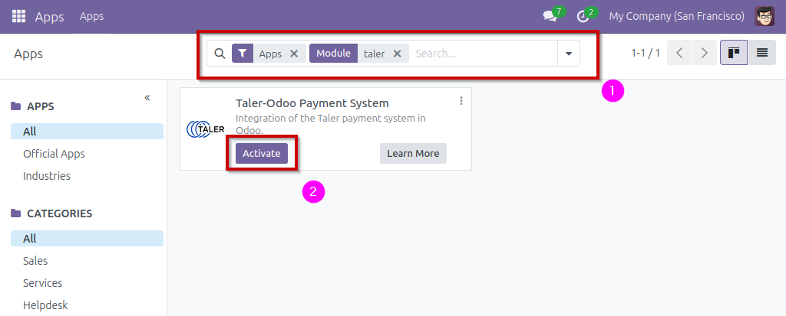

When you have copied the files of the payment_taler module in your Odoo instance's directory, and setup the addons-path parameter, you can search for the payment_taler module **(1)** in the Odoo apps, and activate it **(2)**. Activating the module is the same as installing it on your Odoo instance.

### Taler payment provider setup
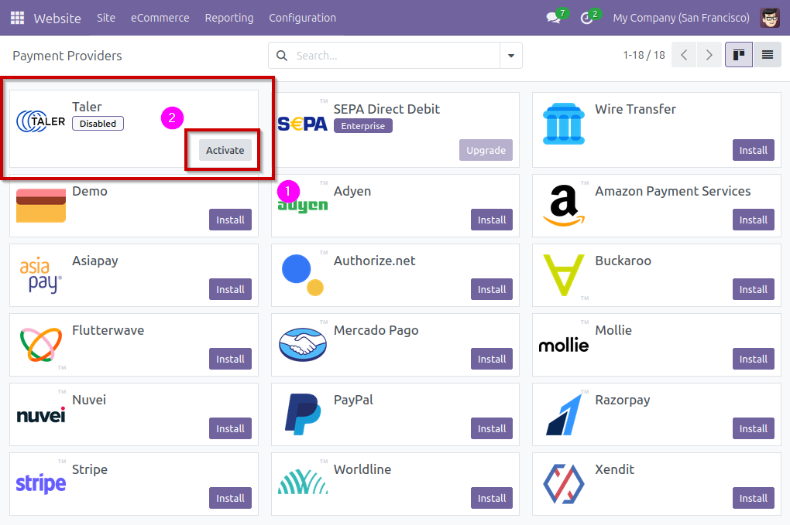

Once the module is activated, you can find the payments providers in `Website -> Configuration -> Online Payments -> Payment Providers`

In this list you can find the Taler payment provider **(1)** (disabled by default), and activate it **(2)**.

Activating or clicking on the payment provider will lead you to the payment provider's page:

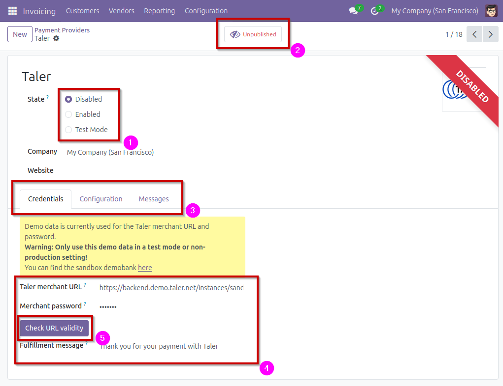

On this page, you can see the current status for the payment provider:
- The payment provider can be `Disabled`, `Enabled`, or in `Test Mode`. **(1)** (See README for more information)
- The payment provider can be `Unpublished` or `Published`. **(2)** (See README for more information)

You can see three tabs, `Credentials`, `Configuration`, `Messages`. For this setup, only the tab `Credentials` will be used. **(3)**

In the credentials, you will have to setup the Taler merchant URL and the corresponding password for the Taler instance you would like to use. **(4)**

After setting up the URL, you can press `Check URL validity`, this will connect to the entered URL, and see if the accepted currencies is compatible with Odoo's currencies. **(5)** (See documentation for more information)

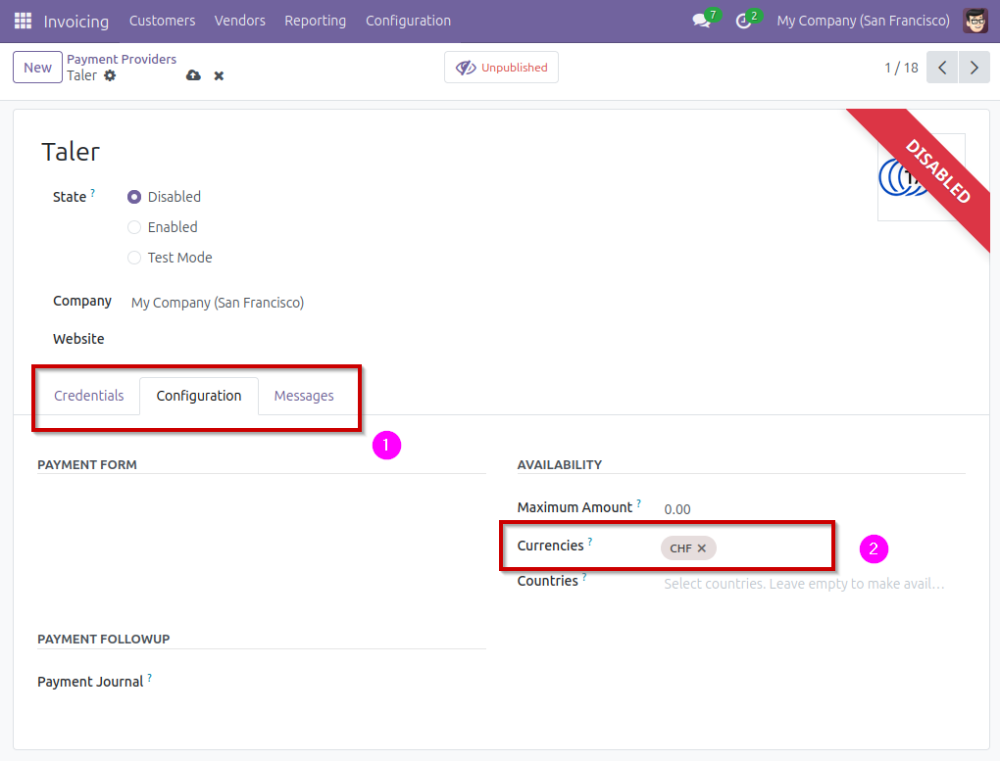

In the payment provider's `Configuration` tab **(1)**, you can find the list of currencies that the payment provider will be able to use. **(2)**

### Online payments using Taler
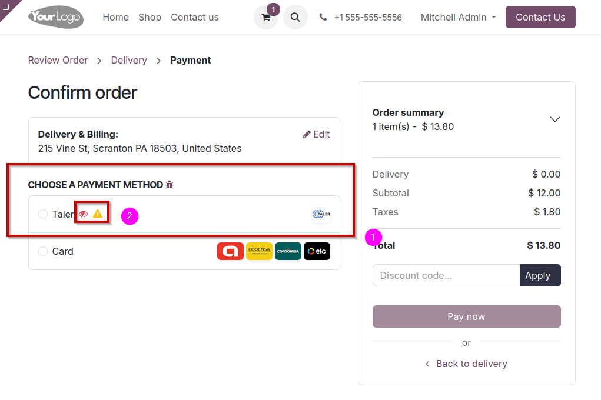

When a customer is ready to pay online for their cart, they will be able to choose which payment method to use. If the currencies are correctly set-up, Taler should be one of the options provided. **(1)**

You might see symbols next to the payment method: **(2)**
- A striked-through eye means that this payment method can only be seen by an admin (generally used when testing a new payment provider)
- A yellow warning sign means that the payment provider is in test mode. Avoid using the test mode in production.

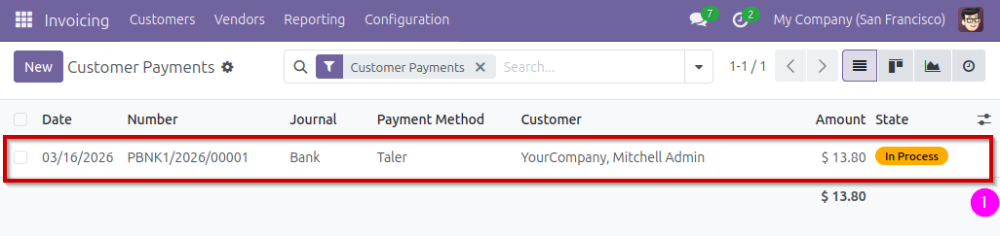

When the payment is complete, on the admin-side, you can navigate to `Invoicing -> Customers -> Payments` to see the list of payments, and find the one

### Trigger a refund for an online payment

Find the payment you would like to refund in the payment list, in `Invoicing -> Customers -> Payments`, anc click on the payment you'd like to refund.

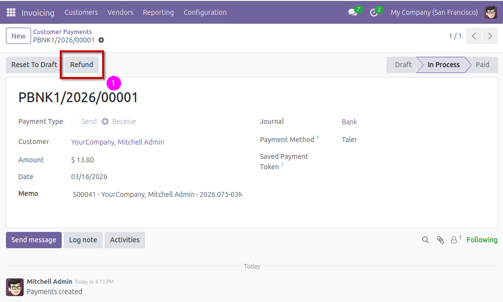

Click on the `Refund` button and confirm the amount you'd like to refund. **(1)**

This action will create a refund QR Code, and send it via email to the customer.

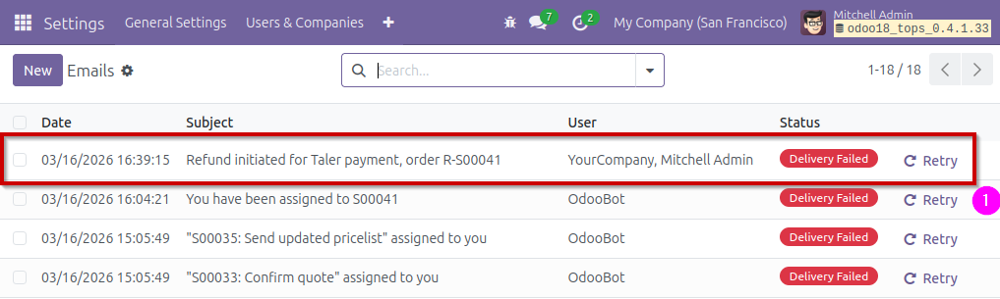

To see the email, navigate to `Settings -> Technical -> Emails`
- You may need to activate Odoo's `Developer` mode to access this tab (it is found in the settings)

This will display a list of emails, click on the one you want to check.

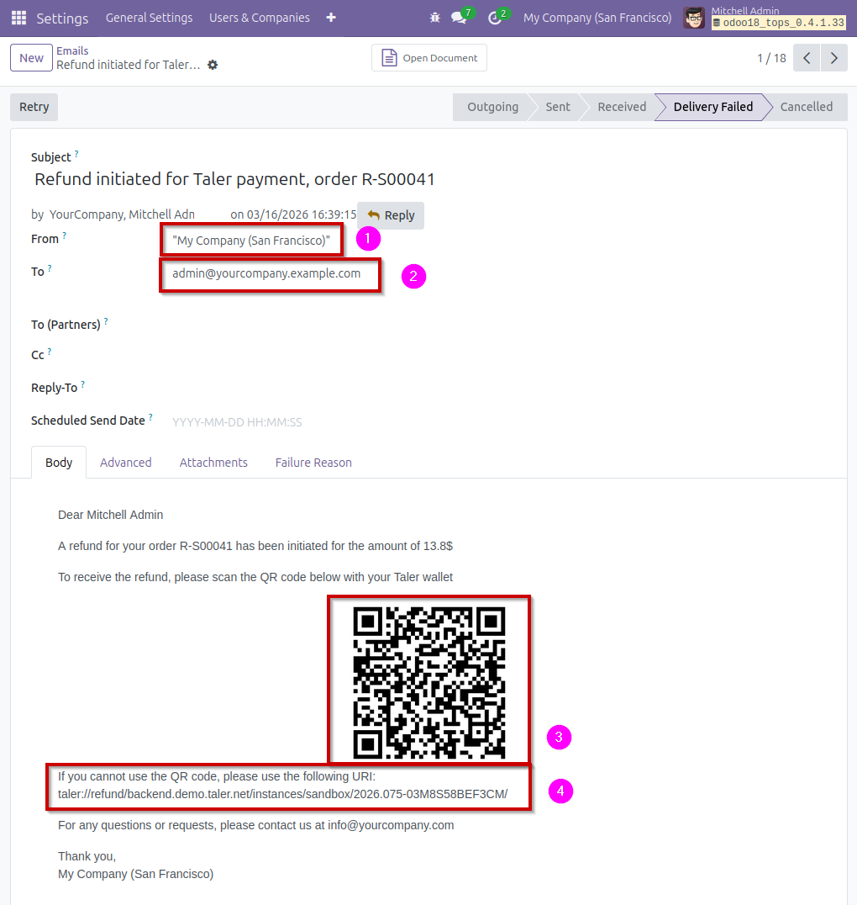

On the email page, you can see the email address it has been sent from **(1)** and to **(2)**. You can also see the refund QR Code that has been sent to the customer **(3)**, as well as the URI that can be used in case the customer cannot use the QR Code. **(4)**

### Create an invoice that includes a Taler QR Code
To make an invoice that displays a Taler QR Code as a payment option, you need to create an invoice, and specify Taler as the payment method.

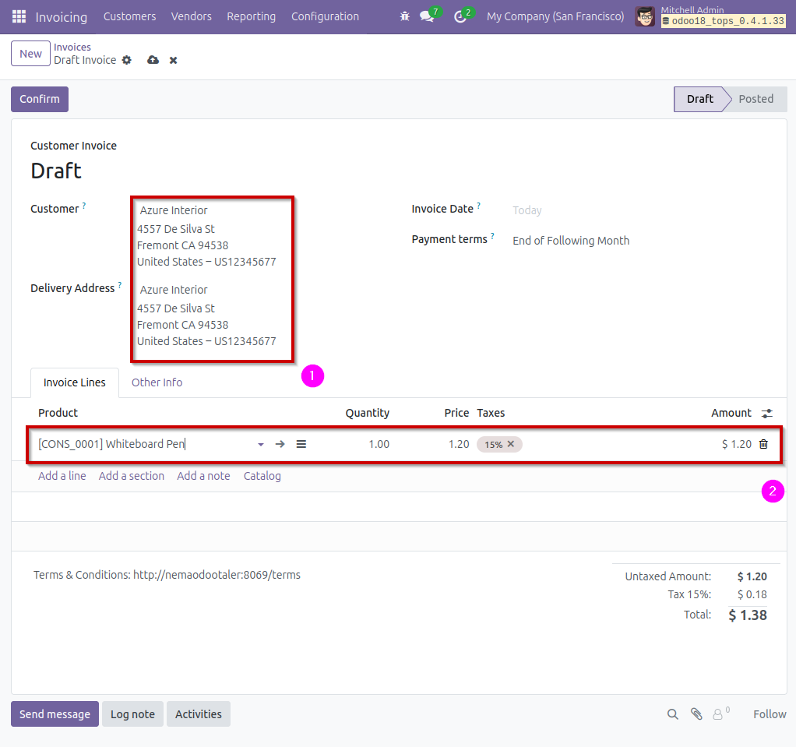

This is a new invoice with some data filled in, namely the customer **(1)** and the invoiced product. **(2)**

In the `Other Info` tab, you need to set the field `Payment Method` to the value `Taler`. This indicates that you intend for the customer to pay this invoice with Taler (However, despite this setting, other online payment options can still be used to pay for the invoice)

Once filled, you can `Confirm` the invoice and then see the `Preview` of the invoice by clicking the corresponding buttons on the top of the page.

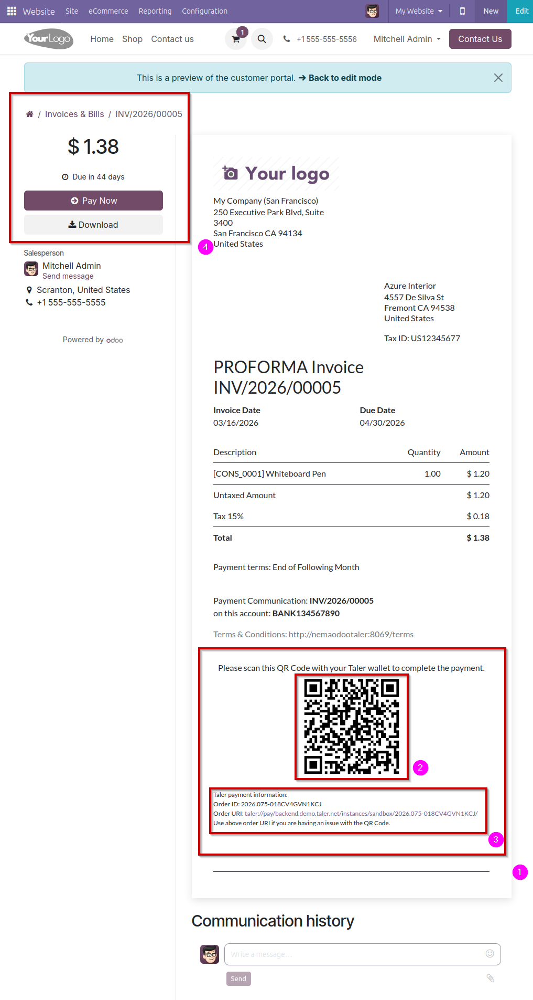

You can see the `Taler` section at the bottom of the invoice **(1)**, that wouldn't appear if the `Payment Method` of the invoice was not set to `Taler`. In this section, you can see the Taler QR Code that can be used to pay **(2)**, as well as the URI that can be used in case the customer cannot use the QR Code. **(3)**

On the top-left of the invoice, you can also see a `Pay Now` button. This button allows the customer to pay via Online Payment, and clicking it will start the `Online Payment` flow. **(4)**

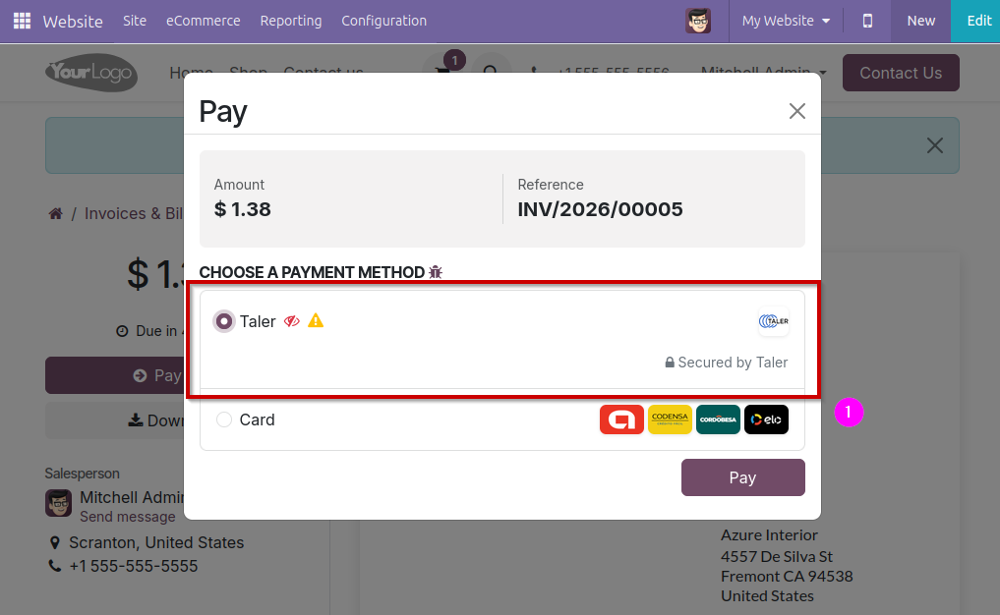

In this menu, the customer can choose to pay online with Taler. **(1)**

Selecting this option will start the Online Payment flow that this add-on implements, as opposed to the invoice payment flow that would have been used if the customer paid using the invoice's QR Code.

### Point of sale payment setup
To setup Taler payment for the Point of Sale, you have to setup a new payment method in the POS app.

Go to `Point-of-Sale -> Configuration -> Payment Methods` and click `New`.

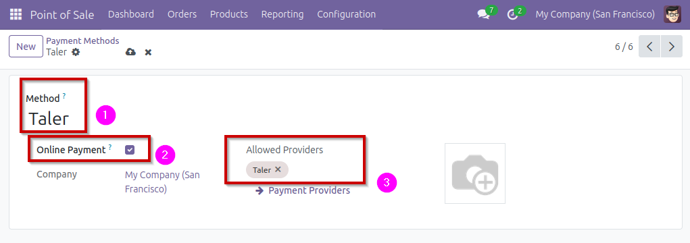

On this new Point of Sale payment method, set the name (Taler) **(1)**, tick the `Online Payment` option **(2)**, and select Taler as an `Allowed Provider` **(3)**. The Taler payment provider must be Enabled, or it will not appear in the list of available providers.

> Note: This `Taler` payment method is specific to the point of sale, and is different from the payment methods created by default by this add-on.

Once this is done, you need to add this new payment provider to each point of sale that you would like to use it in. To do that, go to `Configuration -> Point of Sales` and click on the point of sale you would like to edit.

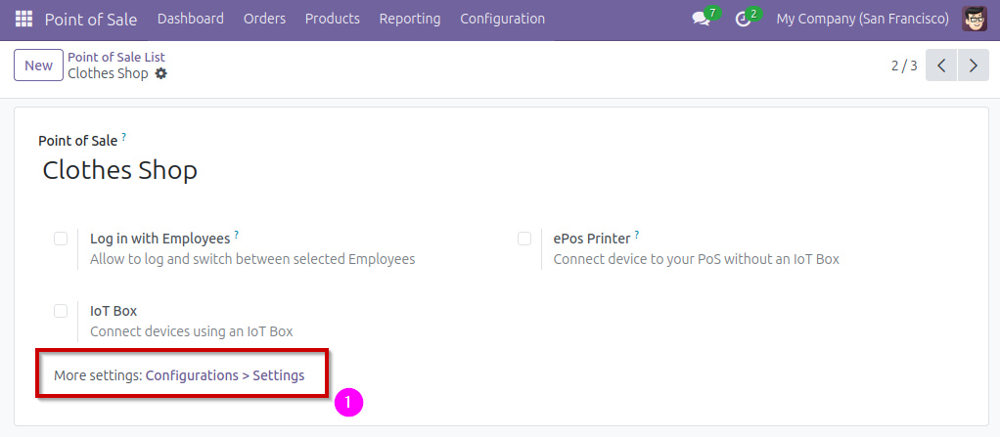

On this page, click on `More settings: Configurations > Settings` **(1)** to be sent to the settings page for this point of sale.

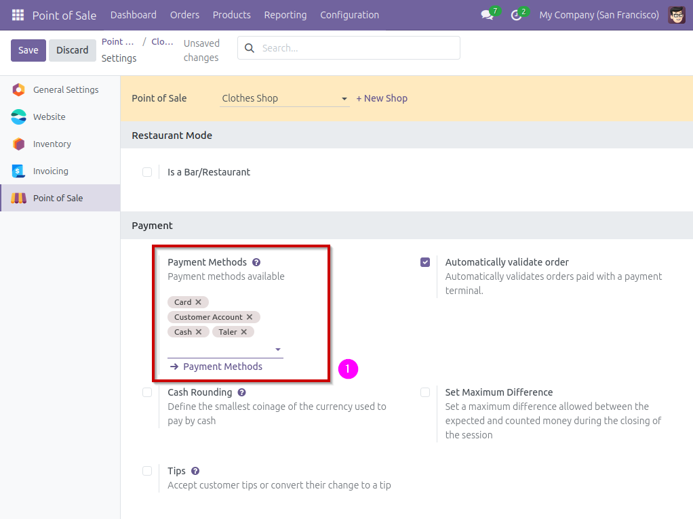

On the settings page, add to the setting `Payment Methods` **(1)**, add the new `Taler` payment method you created earlier.

After this you're good to go for customers to pay on Point of Sales using Taler!

### Point of Sale payments using Taler
Paying at a point of sale using Taler is pretty straightforward, and it uses Taler's online payment flow.

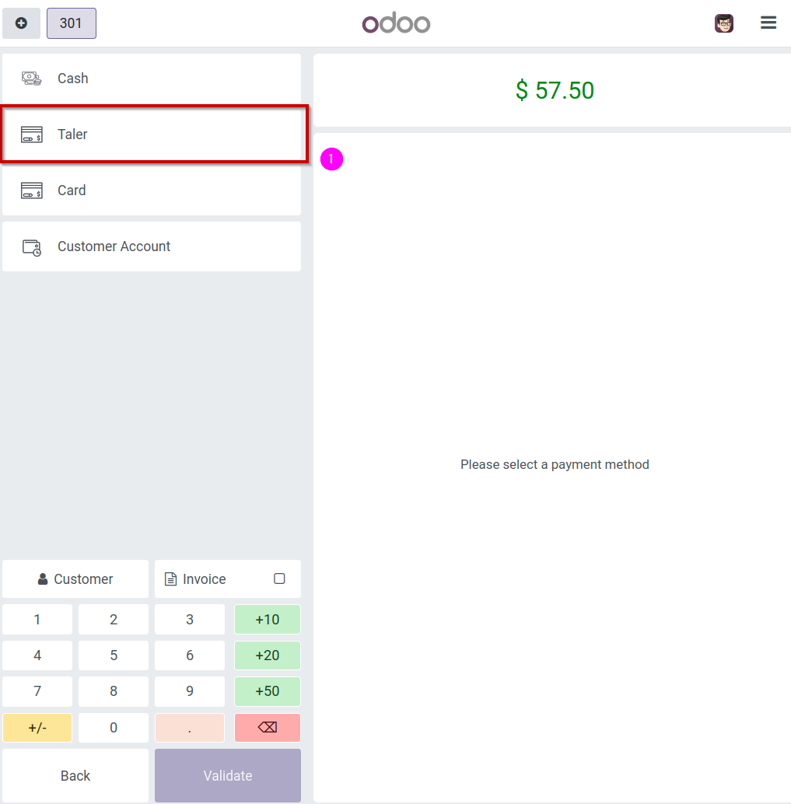

When a customer's cart is finalized, press `Payment` and select `Taler` **(1)** as a payment method, and validate.

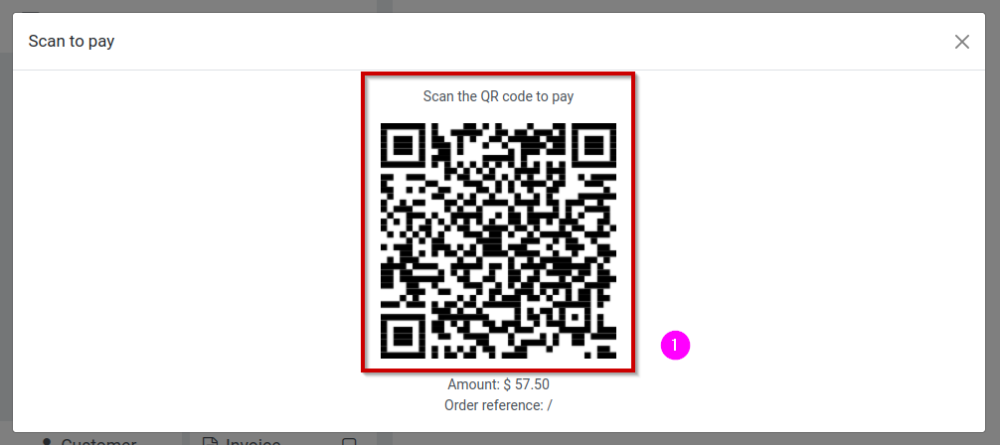

The customer will be presented with a QR Code **(1)**, that they can scan to complete a payment via Taler.
