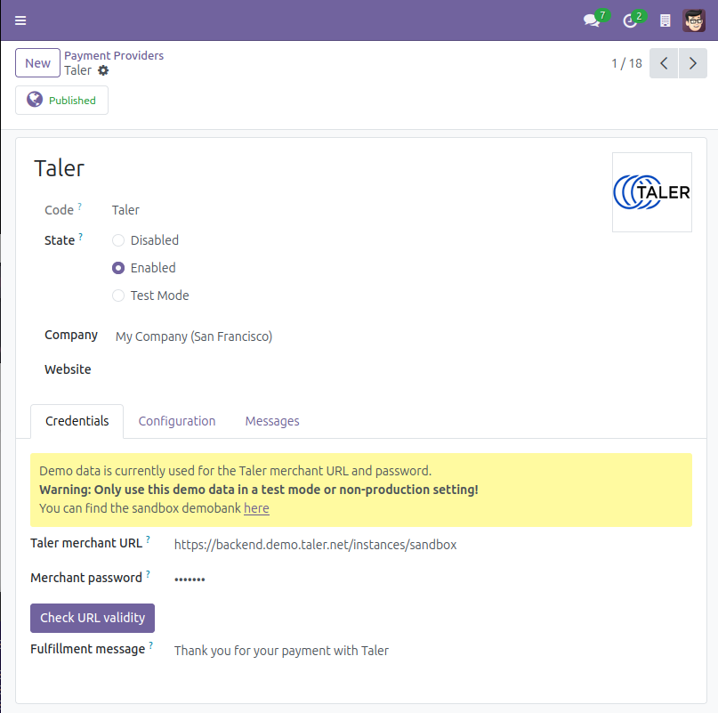

.. SPDX-FileCopyrightText: 2025 Mael Panouillot <panouillot.mael@gmail.com>
.. SPDX-License-Identifier: LGPL-3.0-or-later

Configuration
=============

.. contents:: On this page:
   :local:

.. The following line is a target used in section "Configure Taler payment for point of sale".
.. _payment-provider-configuration:

Configuration of the Taler payment provider
~~~~~~~~~~~~~~~~~~~~~~~~~~~~~~~~~~~~~~~~~~~

- Once the add-on is installed from the Apps:

  - Go to the payment providers menu. It can be accessed in multiple
    ways:

    - ``Website -> Configuration -> eCommerce -> Payment Providers``.
    - ``Invoicing -> Configuration -> Online Payments -> Payment Provider``\ s.

  - Either way you land here, this is the list of your currently
    available payment providers.
  - A new ``Taler`` payment provider will be in this list, set as
    disabled for now.
  - Click on the Taler payment provider.
  - In the ``Credentials`` tab, set the Taler merchant URL.

    - By default, the demobank’s credentials are used. You can access
      the demobank
      `here <https://backend.demo.taler.net/instances/sandbox/>`__
    - After setting the URL, you can click the ``Check URL validity``
      button to check if the entered URL is reaching a valid Taler
      merchant, and that this merchant’s accepted currencies are
      compatible with you Taler available currencies.

      - You can find the accepted currencies in the ``Configuration``
        tab.

  - Then set the Taler Merchant Password. It will be used for API calls
    to the merchant.
  - You may want change the Taler fulfillment message as well. It will
    be shown on created Taler transactions

    - This change is only for the Taler order, there will be no change
      in Odoo.
    - If you’d like to change the Odoo fulfillment messages shown to the
      customers after a payment using Taler, you can do so in the
      ``Messages`` tab.

  - The default values are connecting to the sandbox Taler merchant:

    - URL: https://backend.demo.taler.net/instances/sandbox
    - Password: sandbox

  - It is advised, but completely optional, to create a Taler-specific
    Journal (this can be set in the Configuration tab).

    - This will help during the Accounting process.

  - Click the ``Enabled`` radio button.

- The initial setup is now complete and Taler payment will be available
  in all eCommerce, online payments and Invoicing apps.

