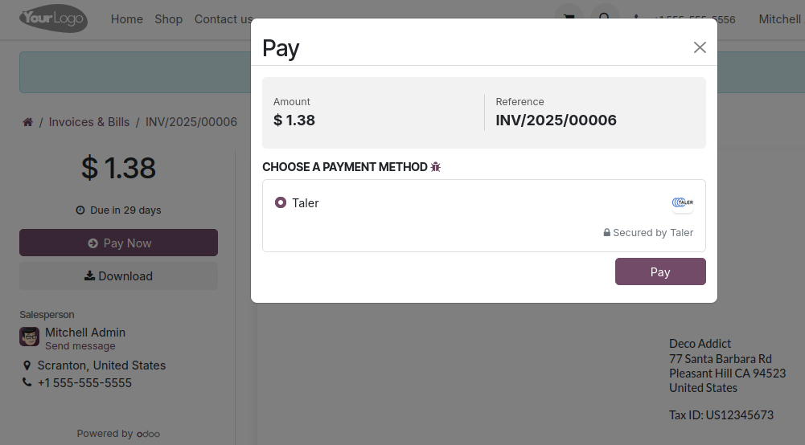

.. SPDX-FileCopyrightText: 2025 Mael Panouillot <panouillot.mael@gmail.com>
.. SPDX-License-Identifier: LGPL-3.0-or-later

Invoicing
=========

.. contents:: On this page:
   :local:

Create an invoice that can be paid using Taler
~~~~~~~~~~~~~~~~~~~~~~~~~~~~~~~~~~~~~~~~~~~~~~

- It is possible to create an invoice that includes a Taler QR Code to
  pay it.

  - Go to the Invoicing app and create a new invoice.
  - Fill any data relevant to the invoice that you are creating.
  - Important step: In the ``Other Info`` tab, set the Payment Method to
    ``Taler`` (see below). Otherwise, the QR Code will not be generated.

.. image:: ../images/EN/Taler_invoices_payment_method.png
   :alt: Taler invoices payment method
   :width: 100%
   :align: center

- When you are done, click ``Confirm`` at the top, you will be led to
  the invoice page.

  - You can now click ``Preview`` to see the Invoice that will be sent
    to your customer.
  - The invoice’s PDF will include a Taler payment QR Code, as well as
    some Taler order information.

.. image:: ../images/EN/Taler_invoices_taler_qr_code.png
   :alt: Taler invoices taler qr code
   :width: 100%
   :align: center

- If a customer pays for the invoice using the QR Code present in the
  PDF, you will have to do a manual payment reconciliation.

  - To do this, once you confirm that you received the payment, go to
    the Invoices’ app page.
  - Click on ``Pay``.
  - Confirm the data shown in the opened window, it is recommended to
    add the Taler OrderID shown on the invoice, to the ``Memo`` field,
    to keep track of the payment more easily.
  - Press ``Create Payment``.

Pay an invoice online using Taler
~~~~~~~~~~~~~~~~~~~~~~~~~~~~~~~~~

.. note::
   This process is unrelated to the invoices created with Taler in the previous step

   Any invoice can be paid online using Taler.

- Go to the Invoicing app and create a new invoice.
- Once created, you can press ``Preview`` to see the page that the
  customer will see.
- On this page, the user will be able to click ``Pay Now``, and choose
  Taler as a payment option.

- Once they click ``Pay``, they will be redirected to the Taler order
  page, where they can pay with a Taler wallet on their phone or web
  browser (in the same way as for an eCommerce payment).
- When the payment is complete, the customer will be sent back to the
  invoice page, with a notice saying that the payment is successful.

.. image:: ../images/EN/Taler_invoices_paid_online.png
   :alt: Taler invoices paid online
   :width: 100%
   :align: center
