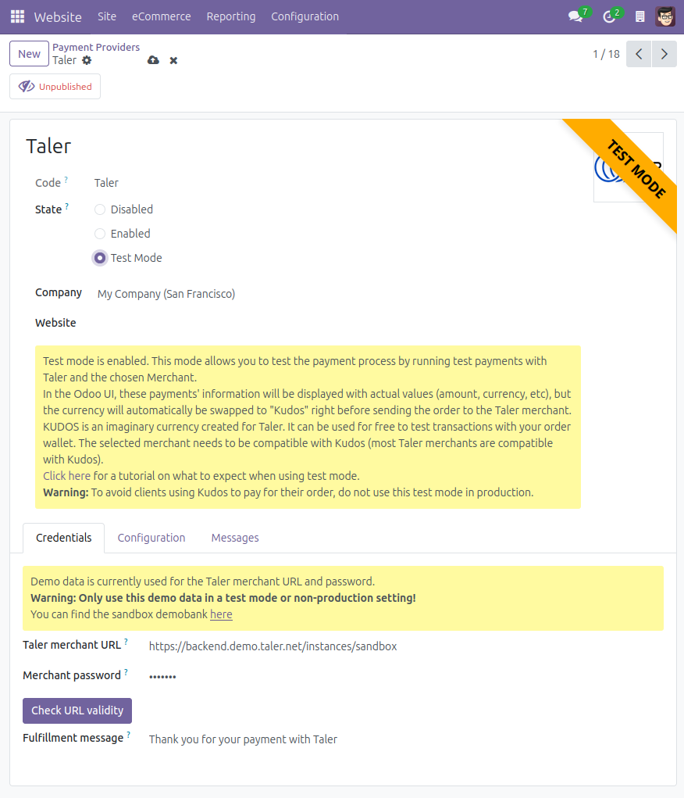
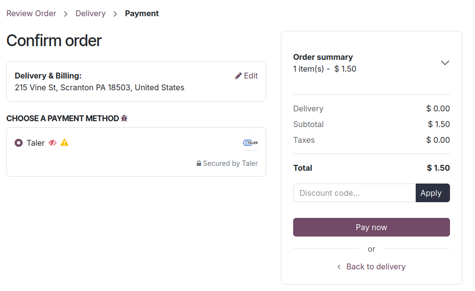

.. SPDX-FileCopyrightText: 2025 Mael Panouillot <panouillot.mael@gmail.com>
.. SPDX-License-Identifier: LGPL-3.0-or-later

Merchant Test Mode
==================

.. contents:: On this page:
   :local:

Test the add-on using the merchant test mode
~~~~~~~~~~~~~~~~~~~~~~~~~~~~~~~~~~~~~~~~~~~~

- The merchant test mode allows you to test the installation of the
  module, and confirm that the selected merchant are working properly.

.. warning::

   Do not use this mode in production or with published items for sale.

.. note::
  - You can decide to keep the payment provider ``Unpublished`` when using Test Mode, or to ``Publish`` it by clicking the button at the top of the page. If a payment provider is unpublished only an administrator users will be able to see and use the payment provider. It is advised to keep the payment provider unpublished when using the Test Mode.*

.. note::
  In the Odoo UI, the payment information will be shown with actual values (amount, currency, etc), but the currency will automatically be swapped to ``Kudos`` right before sending the order to the Taler merchant.*

- Here is an example of the flow for this feature:

  - On the payment provider’s page, check the ``Test Mode`` radio
    button.

- Start the process for any online payment, I will show the process for
  an eCommerce payment.

  - Navigate to the shop page.
  - Select any product that you’d like to buy as a test, go to your cart
    and start the checkout process.
  - Once you confirm your order, the Taler payment method will appear,
    with some icons.

- Explanation of the icons:

  - The red striked-through eye means ``Unpublished``. It is there to
    let you know that this payment method is not visible to visitors,
    only users that have administrator access rights to the shop will be
    able to see the test mode Taler payment provider.
  - The yellow warning sign means ``Test mode``. It is there to warn you
    that the test mode is activated for this payment method.

- Pay the order. A corresponding order will be created on the Taler
  merchant, with a currency change.

  - The currency originally used will be swapped with ``Kudos``.

    - Kudos is an imaginary currency created for Taler. It can be used
      for free to test transactions with your Taler wallet.

- A Taler order will be created, you can open it and pay with your
  wallet. (Notice that the currency is replaced with Kudos.)

.. image:: ../images/EN/Taler_test_mode_taler_order_payment.png
   :alt: Taler test mode payment on Taler, showing kudos currency
   :width: 100%
   :align: center

- Once the order is paid using the imaginary currency, you will be sent
  back to the completed Odoo order.

.. image:: ../images/EN/Taler_test_mode_taler_payment_completed.png
   :alt: Taler test mode payment shown as completed on Odoo website
   :width: 100%
   :align: center

- When this step is done, the test is complete. You have confirmed that the add-on works, and the Taler merchant endpoint can receive your orders for compatible currencies.
