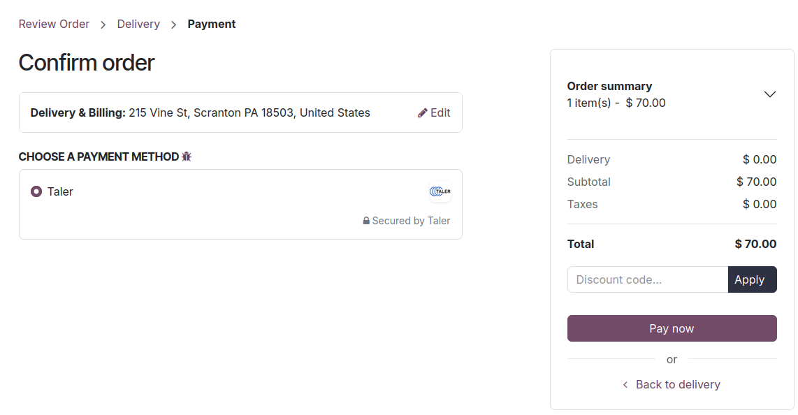
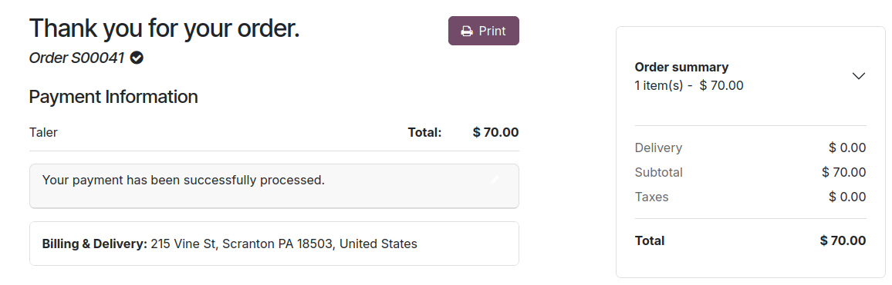
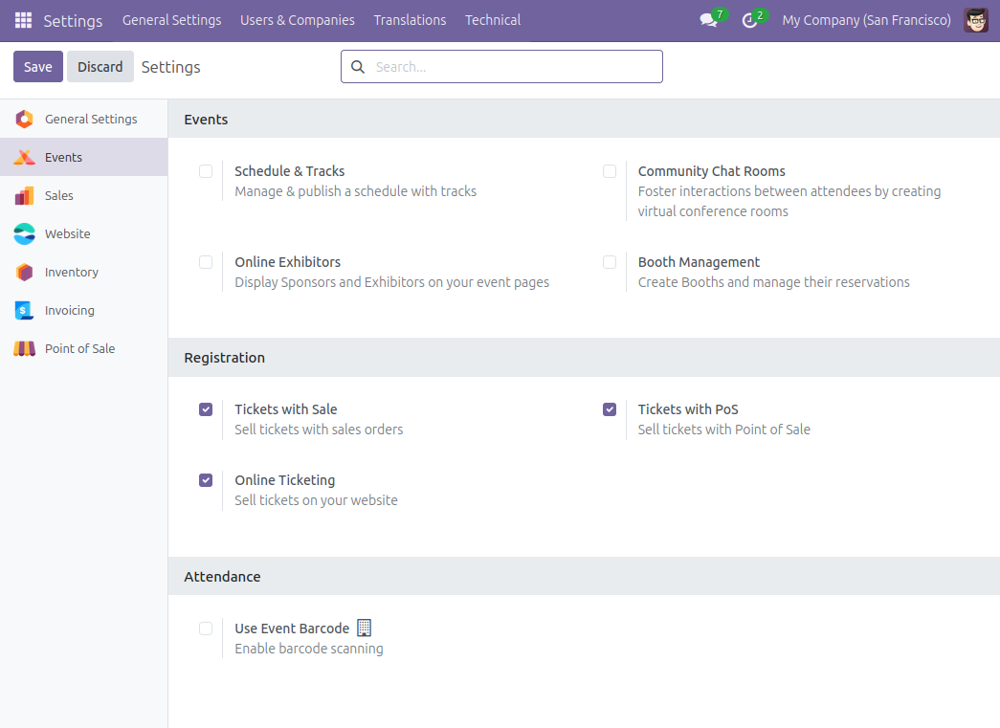

.. SPDX-FileCopyrightText: 2025 Mael Panouillot <panouillot.mael@gmail.com>
.. SPDX-License-Identifier: LGPL-3.0-or-later

Payments
========

.. contents:: On this page:
   :local:

Complete an eCommerce payment using Taler
~~~~~~~~~~~~~~~~~~~~~~~~~~~~~~~~~~~~~~~~~

- Once you have completed the Taler initial setup, customers can pay on
  your website.
- To do so, they will open the shop and add any items to their cart.
- During the checkout, they can now select the ``Taler`` payment
  provider.

- After clicking ``Pay now``, a new Taler order will be created on the
  merchant side, and the customer will be redirected to the Taler order,
  from which they can pay with any Taler wallet on their phone or web
  browser.

.. image:: ../images/EN/Taler_ecommerce_wallet.png
   :alt: Taler eCommerce wallet
   :width: 100%
   :align: center

- Upon completion of the payment using their wallet, the customer will be
  redirected back to your Odoo website, which will show a successful
  payment confirmation.

Purchase an Event ticket online using Taler
~~~~~~~~~~~~~~~~~~~~~~~~~~~~~~~~~~~~~~~~~~~

.. note::

   To have a fully working ticketing system, you might need to install the python module pycairo:

    - ``sudo apt install libcairo2-dev``
    - ``pip install rlPyCairo``

- To make event tickets available for customers to pay using Taler:

  - Add the ``Events`` add-on on your Odoo instance.
  - Go to the settings app, and navigate to the ``Events`` settings.
  - Tick the ``Online Ticketing`` setting and save the changes.

- Tickets will now be available to buy using online payments providers,
  including the Taler payment provider.
- Customers can navigate the ``Events`` tab on your website, and choose
  a ticket to any event they’re interested in.

.. image:: ../images/EN/Taler_ticketing_events_list.png
   :alt: Taler ticketing event list
   :width: 100%
   :align: center

- Upon clicking an event, they will be asked to provide some identifying
  information, and then will be lead to a payment page.
- On this payment page, the customer can select Taler as a payment
  provider.
- They will be redirected to a Taler order page, where they can pay
  using their Taler wallet on the app or web browser.
- Once the payment is completed, the customer will land back on the odoo
  page, with their payment successfully processed, and a .pdf of the
  event tickets available.

.. image:: ../images/EN/Taler_ticketing_event_payment_confirmation.png
   :alt: Taler ticketing event payment confirmation
   :width: 100%
   :align: center
