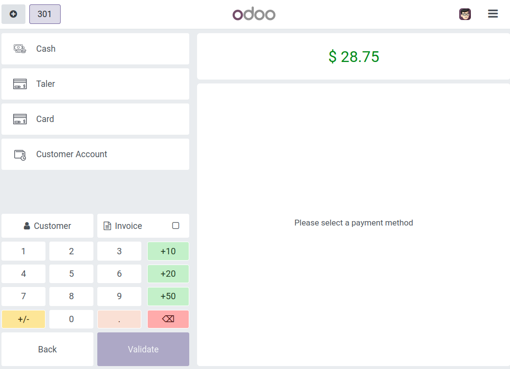

.. SPDX-FileCopyrightText: 2025 Mael Panouillot <panouillot.mael@gmail.com>
.. SPDX-License-Identifier: LGPL-3.0-or-later

Point of Sale
=============

.. contents:: On this page:
   :local:

.. The following line is a target used in section "Uninstall the add-on".
.. _point-of-sale-payment-configuration:

Configure Taler payment for point of sale
~~~~~~~~~~~~~~~~~~~~~~~~~~~~~~~~~~~~~~~~~

- Allowing Taler payment on the point-of-sale app requires a few more steps than regular online payments.
- Preliminary steps:

  - Have previously :ref:`setup Taler as a payment
    provider <payment-provider-configuration>`.

  - Install the ``Point of sale`` Odoo app.

- Create the Point of Sale payment method:

  - On the top bar, press ``Configuration -> Payment Methods``.
  - Create a new Payment Method.

    - Name it ``Taler`` (You can call it something else, but ``Taler``
      is easier to keep track of).
    - Check the ``Online Payment`` checkbox.
    - Select ``Taler`` in the ``Allowed Providers`` field.

- Add Taler to the point of sale:

  - Make sure that the point of sale register is closed for this step.
  - On the top bar, press ``Configuration -> Point of Sales``, you will
    be redirected to the point of sale list.
  - Select the point of sale you’d like to add Taler payment to.
  - Click on ``More settings: Configurations > Settings``, which will
    lead you to the point of sale’s settings page.

    - Alternatively, you can access this page by going to Settings
      through the app switcher (top-left button), then going to
      ``Point of Sale`` section, and selecting the point of sale that
      you would like to modify.

  - In ``Payment -> Payment Methods``, add the payment method you just
    created (generally ``Taler``).

- The setup is now complete, and you can select this new payment
  provider when a customer pay for an order on the Point of sale that
  you added the payment method to.

Pay using Taler at a Point of Sale
~~~~~~~~~~~~~~~~~~~~~~~~~~~~~~~~~~

- Open a register on one of the Points of Sale for which you have
  activated the Taler payment method.
- Add any items to the order and click ``Payment`` at the bottom of the
  page.
- Select the payment method ``Taler`` payment method.

- Click ``Validate``, it will show a QR Code.
- Scanning this QR Code will redirect to an Odoo page, where the
  customer will be able to pay with Taler.
- This will bring the customer to a Taler order page, and they will be
  able to pay using their Taler wallet or web browser.
- Upon payment completion, the customer will be redirected to Odoo, with
  a confirmation of payment (first picture), and the order on the point
  of sale’s side will show a successful payment, and produce the receipt
  (second picture).

.. image:: ../images/EN/Taler_pos_payment_complete.png
   :alt: Taler pos payment complete
   :width: 100%
   :align: center

.. image:: ../images/EN/Taler_pos_receipt.png
   :alt: Taler pos receipt
   :width: 100%
   :align: center
