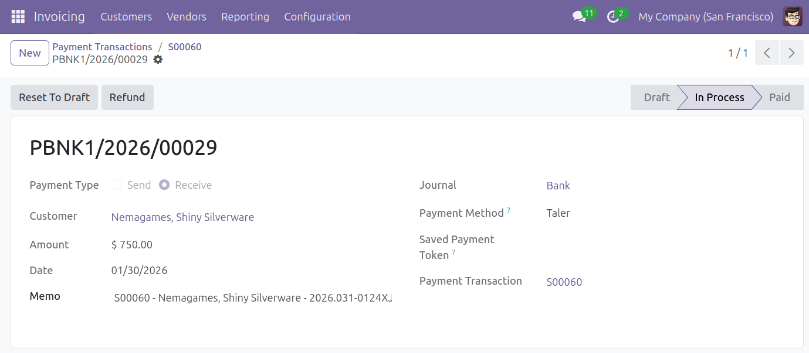

.. SPDX-FileCopyrightText: 2025 Mael Panouillot <panouillot.mael@gmail.com>
.. SPDX-License-Identifier: LGPL-3.0-or-later

Refunds
=======

.. contents:: On this page:
   :local:

Refund an online payment made using Taler
~~~~~~~~~~~~~~~~~~~~~~~~~~~~~~~~~~~~~~~~~

- To make a refund to a payment made using Taler, you first have to find
  the payment you wish to refund.
- For Odoo 18, in the ``invoicing`` add-on, navigate to ``Customers -> Customer Payments`` on the top bar.
- For Odoo 19, the location is ``Customers -> Payments``.

  - This page will show you all the payments that have been completed.
  - In this example, we want to refund the payment ``PBNK1/2026/00029``.
  - For a more technical option, activate the developper mode in the
    settings, navigate to ``Configuration -> Payment Transactions`` on
    the top bar, selecte a transaction, and click on the payment in the
    ``payment`` field on the transaction’s page.

- Click on the payment that you would like to start the refund process
  for.
- On the payment page, click ``Refund`` in the action button section
  (top-left) and confirm the refund.

- You can set the amount you'd like to refund. The refund amount cannot be higher than the transaction amount

  - You can make multiple partial refunds (for example, a 30 euros transaction can be refunded by 5 euros, and then 10 euros later)
  - In case of partial refunds, the total refunded amount across multiple refunds of one transaction cannot exceed the transaction amount.

- Confirming the refund will create a new transaction, that you can view
  in the list of transactions, with the name
  ``R-{Odoo reference number}``.

  - An email containing the refund QR Code will also be sent to the
    customer’s email address.

    - You can view this email in the list of sent emails, found in
      ``Settings app -> Technical -> Emails``

      - You may need to activate Odoo’s ``Developer`` mode (found in the
        settings) to access the ``Technical`` tab.

  - To receive the refund, the customer will have to scan the QR Code
    with their Taler wallet.

.. image:: ../images/EN/Taler_refund_email.png
   :alt: Taler refund email to customer
   :width: 100%
   :align: center

.. note::
   - You need a functional email sender for this feature to work properly.
   - Without an email sender, the email will be generated and can be read, but it will not be sent.
   - You can only do full refunds using Taler. Partial refunds are not implemented.
